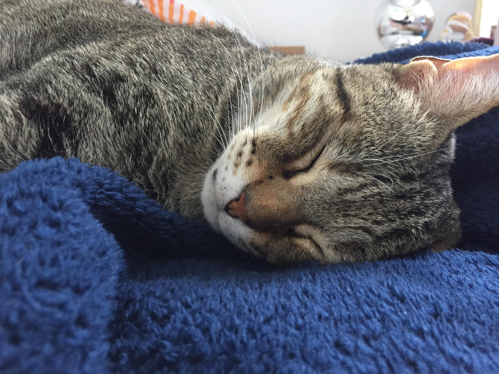
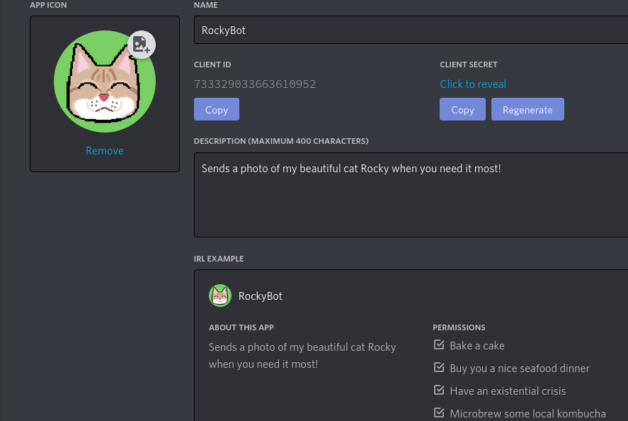
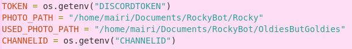
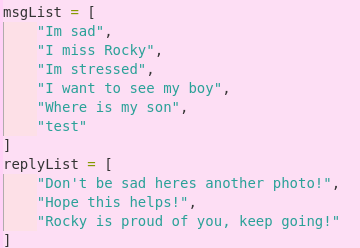
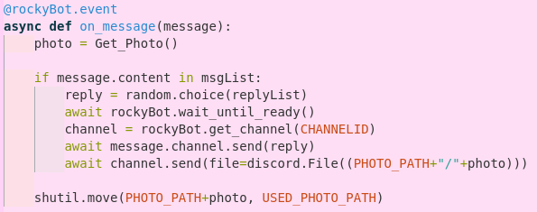
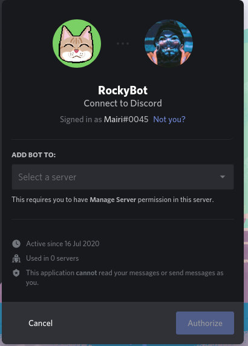
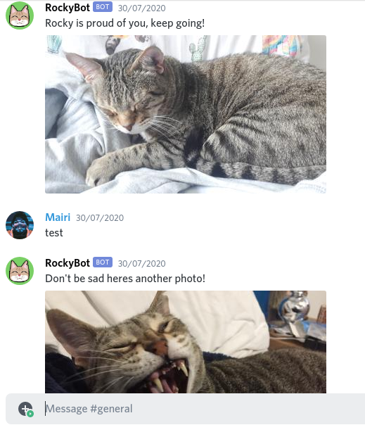
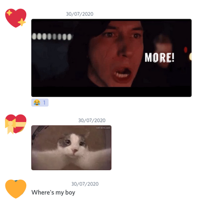

---

If you have read part one of the Adventures of RockyBot then you will know that I prevously attempted to make this in Twitter. Not wanting to simply give up on providing the world with photos of my cat I decided to try and make the bot on Discord instead. (Spoiler alert: it went really well)
Also before we get into it heres another photo: 

  

 

## Set-up

Lucky for me Discord has a beautiful web client for creating bots and it was so easy to use.
To create RockyBot I first had to create an application, which was as easy as pressing 'New Application' and giving it a name. 
From here I gave the application a photo and a brief description.

  

 
Before I get any tweets about this, yes I am aware the ID is visible and no it doesn't matter.
To make the actual bot that I can invite to servers I went to the 'Bot' tab and pressed 'Add Bot'

  

 

This gave me access to a bot token, required for doing anything with python, and allowed me to set the permissions required. I made sure to turn off 'PUBLIC BOT' so only I can add RockyBot to a server. I don't want him on too many servers incase there's a bug and I get 100 emails asking to fix it. 

Once the inital bot set-up was complete I moved on to ensuring that all the python libraries I wanted to use were installed.
The libraries I used are; **os, random, shutil and discord**.

## Programming

After discovering that `from topsecretfile.py import *` does not work (Something I should have checked on my TwitterBot script...) I decided to use Linux enviromental variables instead. 
This allows me to not include sensitive information in Git commits but still access them in my Python script.

I discovered that using `os.environ` in Python only works for as long as the script is working and using `export VARNAME=CONTENTS` persists for as long as the terminal itself does.
I didn't want to have to retype all the export commands if I accidently closed the terminal so I went into the `etc/enviroment` file and added the variables there.
I then accessed the data using the os library.

  

 

(When trying to get a channel ID make sure you have developer mode **on** first)

Then decided that instead of sending a photo of my cat every so many hours, people on the server could instead request one whenever they wanted.
How this works is the bot reads the messages on the channel and if a user sends one that contains a certain phrase such as "Im sad" or "I miss Rocky" the bot will then send a photo.
I also added some replies for the bot to send alongside the images to make it a little more wholesome.

  

 

  

 

You may have noticed that the functions look slightly different than how I would normally define them. This is because the Discord library has set asynchronous function names that it uses to define bot behaviour, also known as <a href="https://discordpy.readthedocs.io/en/latest/api.html#event-reference">Event References</a>. Meaning that I have to use the exact case and all of them must be prepended with a `@clientName.event`.
Not that the case annoys me and messed with my codes feng shui or anything...

As with my Twitter bot I am using the shutil library to then move the sent images into another folder, however I updated the method slightly by concatinating the file path to the file name.
The `Get_Photo` function works identitcally to the one in my original Twitter bot so I won't be talking about it here. 

Finally, all that was left was to invite my bot to a server and test that the code works properly. This was not the most intuitive process and requires a URL, which cannot be found on the developer portal for some reason.
`https://discord.com/oauth2/authorize?client_id=BOTID&scope=bot` the bot ID is found in the application tab.
This then took me to a page which allowed me to pick the server I wanted to add it to and after two clicks it's done!

  

(Also add me on Discord, I promise i'm cool)

## End result and Final Thoughts

RockyBot was a huge success and my friends' reactions to the addition of it to our server was very positive.

  

  

The <a href="https://discord.com/developers/applications"> Discord Developer Portal </a> is super straightforward to use and there are plenty of online resources available relating to it. 
So it was really fun to build RockyBot and honestly, I was just glad I didnt have to write an essay in order to get API Keys.

  

 

In all seriousness I would love to complete my Twitter bot and have it working along side the Discord one. Even if I use it for another reason such as making a staggered queue system for my art so I dont just tweet five pieces in one day then nothing for a month.
If I ever do go back to it and am successful in obtaining API keys I will be sure to update my first blog post.

## References 

 

Discord Developer Portal: <a href="https://discord.com/developers/applications">https://discord.com/developers/applications</a>
 
Discord.py Documentation: <a href="https://discordpy.readthedocs.io/en/latest/index.html"> https://discordpy.readthedocs.io/en/latest/index.html </a>
 
Linux Enviroment Variables Guide: <a href="https://linuxize.com/post/how-to-set-and-list-environment-variables-in-linux/"> https://linuxize.com/post/how-to-set-and-list-environment-variables-in-linux/ </a>
 
Discord Bot Tutorial: <a href="https://www.youtube.com/watch?v=nW8c7vT6Hl4&list=PLW3GfRiBCHOhfVoiDZpSz8SM_HybXRPzZ"> https://www.youtube.com/watch?v=nW8c7vT6Hl4&list=PLW3GfRiBCHOhfVoiDZpSz8SM_HybXRPzZ </a>
 
