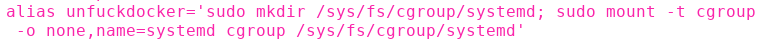
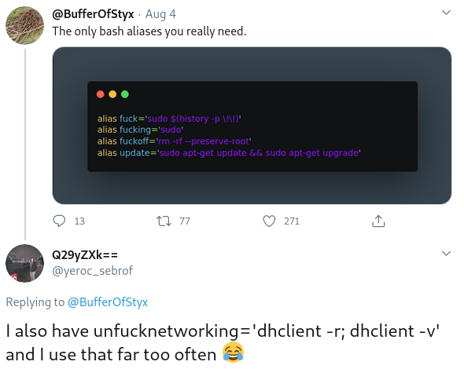
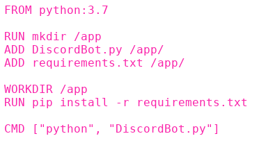
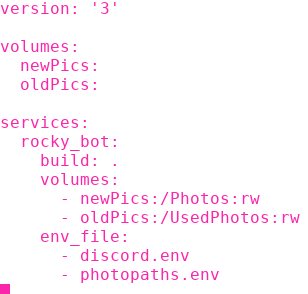
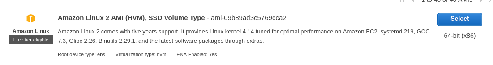
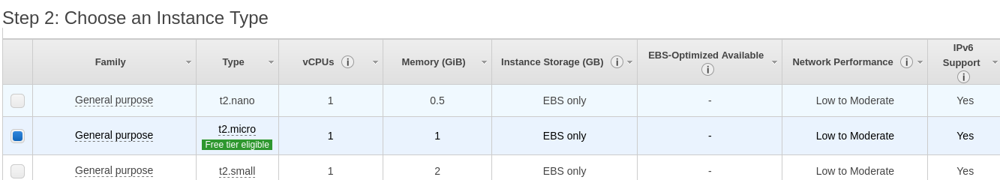

---

I know I said that RockyBot was finished in the last blog but as one last addition, I decided to put the bot in a Docker container and host it on AWS so that it can be online 24/7.
This was mainly to learn about containerization in preperation for my disertation, which I want to do on virtualised enviroments.
But also because my boyfriend, a container stan, dared me to.

So here is a very short update to RockyBot and me writing down what I learnt so I don't forget in a week.

## Set-up

Before I started I decided that I should watch the most in depth tutorial I could find... five hours my third eye was opened, the entire universe's secrets were revealed to me and I thought myself a Docker guru.
Moments later I was brought back to earth when I actually had to implement what I had learnt and realised my brain had frazzled at around the two hour mark.

Once I had installed Docker I discovered an issue where no matter what container image I tried to build from they would not start.
After plenty of stack overflowing, reading through <a href="https://forums.developer.nvidia.com/t/docker-error-response-from-daemon-could-not-select-device-driver-with-capabilities-gpu/128913/4">blogs</a> and crying I found the issue was something to do with the Fedora installation of Docker not creating a certain key file.
Since the command to fix this was long I created a succinct alias so I wouldn't have this problem in future.

  

(The name was *heavily* inspired by these tweets)

  

## Dockerfile

Once I could successfully open containers I set to work creating my dockerfile:

  

I specified that a Python 3.7 image was to be used then added the Discord bot and requirements files, which was created using `pip freeze`.
Used RUN and WORKDIR to create the directory /app and moved the working directory to this location within the container.

## Docker Compose

As mentioned in my previous blog, I decided to use enviromental variables for some of my constants.
To store my variables in the container I used two env files.
One for my token and channel ID and one for my photo paths. 

One issue with using containers is that it can be difficult to alter the contents.
Since I want the flexibility to add or remove cat photos at whim I used volumes to avoid this potential issue.

Volumes exist outwith the 'usual' Docker file system and are accessable from my local machine so are perfect for adding more photos of my beautiful baby boy.

  

## AWS

Due to moving flats and not having a constant internet connection RockyBot was offline for large periods of time and this was deemed unacceptable so I decided to put it on the cloud.
Specifically in an EC2 instance.

I love RockyBot but not enough to pay for it so I chose exclusivley free tier options:

  

  

During the creation of this I set-up a security group, which are essentially firewall rules and means that it can only be accessed by my specific IP address.
Once the instance was up and running I SSH'd into it and cloned my discord-docker branch of the repository, then ran the compose file.
Then I copied the photo folders into the instance and created a symbolic link between them and my local machine.

Now RockyBot is online 24/7/365, i've learnt the basics of Docker and my magnum opus is complete. (so don't worry about *another* RockyBot blog post)

## References 

Docker tutorial (5hours): <a href="https://www.youtube.com/watch?v=RSIstPUiEjY"> https://www.youtube.com/watch?v=RSIstPUiEjY </a>  
Docker Daemon problem solution: <a href="https://forums.developer.nvidia.com/t/docker-error-response-from-daemon-could-not-select-device-driver-with-capabilities-gpu/128913/4">https://forums.developer.nvidia.com/t/docker-error-response-from-daemon-could-not-select-device-driver-with-capabilities-gpu/128913/4</a>  
AWS EC2 instance guide: <a href="https://docs.aws.amazon.com/AWSEC2/latest/UserGuide/get-set-up-for-amazon-ec2.html"> https://docs.aws.amazon.com/AWSEC2/latest/UserGuide/get-set-up-for-amazon-ec2.html</a>

