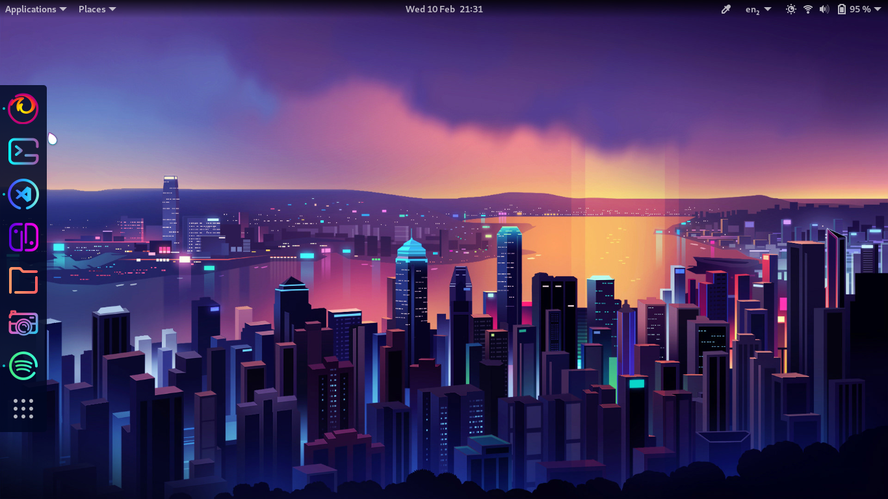
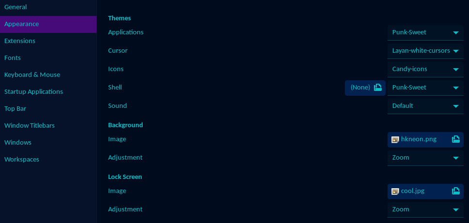
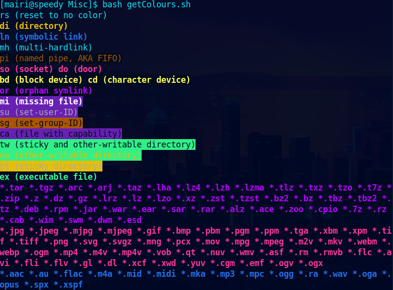
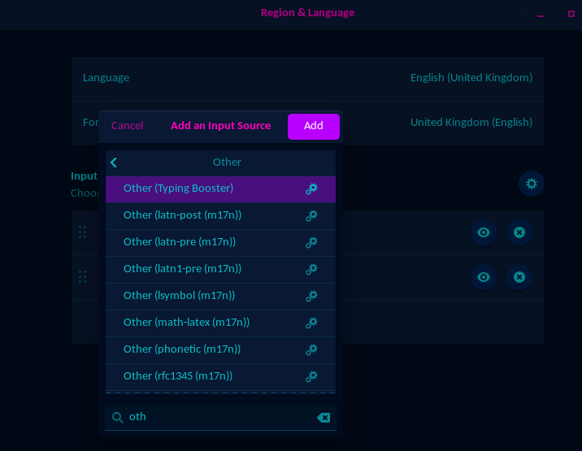
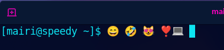
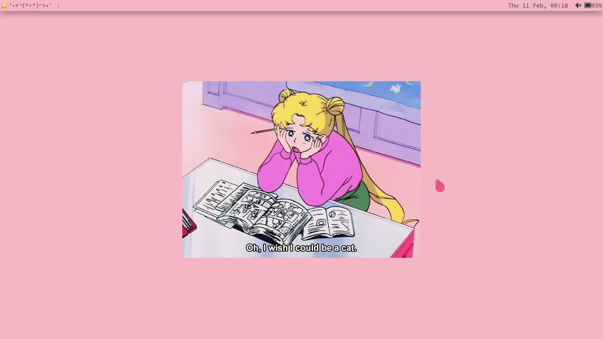
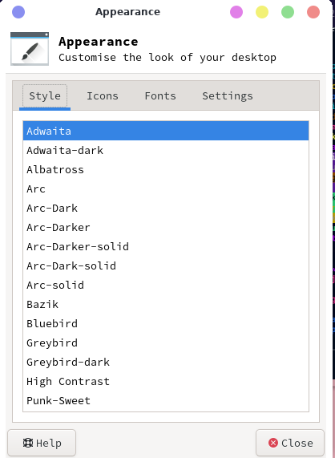
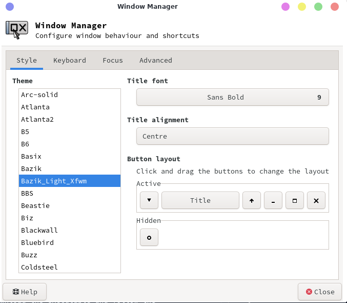
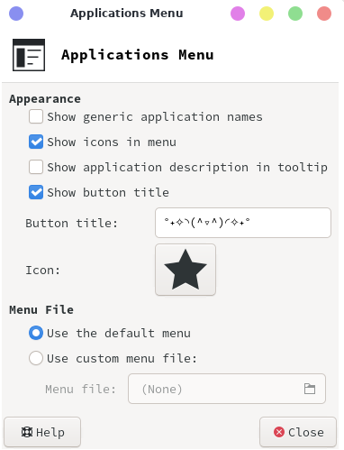

---

## What's in this guide?

- Where to get themes and icons
  - How to install them
- GNOME
  - Setting themes and icons 
  - Shell Extentions
  - Terminal customisation
  - Emojis 😃 
- XFCE
  - Setting themes, icons and windows managers
  - Top bar Customisation

---

I am very fussy with how my OS looks, hence why I favour Linux, and I have spent hours making sure it looks as beautiful as possible. This guide is an excuse for me to write down my steps so when my OS/Laptop/PC breaks (rip Manjaro) I can quickly and easily restore it to it's fabulous self.
Since I use Linux and Windows these guides go through my methodology for both, sorry Mac users but I have no clue. If someone wants to buy me a Macbook i'll be happy to investigate however.

First things first; Decide on the aesthetic you are looking for. In my case I am currently obsessed with the neon cyberpunk/vaporwave look. Although previously I have rocked the pastel pink hyper femme look, just look at my website themes to get a glimpse of my colour pallete journey.

Next follow these steps and customise your heart out!

---

## Getting Themes and Icons
Note: I use Fedora so other Linux distros may have different file paths or required steps

The easiest way to change up your desktop (aside from just changing the wallpaper) is to download a theme.
Both GNOME and XFCE can use GTK files for their themes, these are objects that tell your computer how to draw all the items on screen and can be used to change everything from icons to window colours.

The website <a href="https://www.GNOME-look.org/browse/cat/"> GNOME-look.org </a> is my go to for finding GTK themes and icon packs, they work for XFCE too don't worry. I would advise you read the reviews first as some look nice but are depricated or broken. 

Make sure you are downloading the correct files for your GTK version or your theme change may not work. 
An easy way to check your GTK versions is to use the command: `dpkg -l libgtk2.0-0 libgtk-3-0` or go to `/usr/share` and have a look for the folders gtk-2.0 and gtk-3.0.

After finding the theme of your dreams download the zipped file and extract it into the corresponding folder:  (Copying these files over usually requires sudo) 

- Theme: `/usr/share/themes`
- Icons: `/usr/share/icons`
- Cursor:`/usr/share/icons`

**MAKE SURE THE UNZIPPED FOLDER YOU ARE USING CONTAINS A GTK FILE!**

The next steps and further customisations vary depending on your desktop enviroment:

---

## GNOME
**My laptop theme**

  

  

  
 
    Theme: <a href="https://www.gnome-look.org/p/1314525/"> Punk Sweet</a>  
    Icons:<a href="https://www.gnome-look.org/p/1305251/">Candy Icons</a>  
    Cursor: <a href="https://www.gnome-look.org/p/1365214/">Layan White Cursors</a> 

After downloading and placing your theme/icon/cursor files in the correct folder you go to Tweaks>Appearance and select the the themes you want to implement. (sometimes you need to restart your computer for them to change correctly)

   

### GNOME shell extentions

Want even **more** customisation? Hate that pesky grey top bar? Want a blue light filter? Fret not for <a href="https://extensions.gnome.org/#">GNOME shell extentions</a> has the answer to all of your prayers!
I personally really like jpec's <a href="https://extensions.gnome.org/extension/1264/gradient-top-bar/"> Gradient top bar</a>, TimurKiyivinski's <a href="https://extensions.gnome.org/extension/1276/night-light-slider/"> Night light slider </a> and michele_g's <a href="https://extensions.gnome.org/extension/307/dash-to-dock/"> Dash to dock</a> extentions. I feel they really add a je ne sais quoi to my laptop.

Make sure you keep your extentions updated and like the themes, you check the reviews in case there are any major issues with the extention.

Also **DO NOT** enable the Fedora Background Logo unless you want your computer to melt through yout floor, i'm sure the devs meant well but my laptop almost took off into low orbit when I enabled it in a moment of curiousity.

### GNOME Terminal
Now your desktop is looking beautiful it's time to change your terminal to match.
This is very simple; go to your terminal>Preferences, create a new profle and go ham.
I would recomend using a colour picker to get colours from your theme and implementing them into your terminal rather than using a preset terminal theme. I prefer having more control over my colour scheme.
A good tool is <a href="https://extensions.GNOME.org/extension/3396/color-picker/"> grroot's color picker</a>.

If you want to see what all the terminal colours mean I would recomend using one of the bash scripts written in the answers of this <a href="https://askubuntu.com/questions/17299/what-do-the-different-colors-mean-in-ls">Ask Ubuntu forum</a> or make your own.

   

### Emojis 
What better way to add some pizzaz to your writing experience than add an emoji keyboard? I haven't tried this in XFCE so not sure if it works there too but it is a lot of fun in GNOME.

First go to your terminal and enter `sudo dnf install google-noto-emoji-fonts` (replace dnf install with your package manager). Then go to Settings>Region and Language, press the small plus at the bottom of input sources, select Other(Typing Booster) and click add.

  

 
Then click the cog symbol besides that keyboard, go to Options and make sure 'Unicode symbols and emoji predictions' is ticked. 
To swap keyboards press `super` + `spacebar`.
Now go to any where that lets you type unicode characters, like your terminal, and try it out!

  

 

---

## XFCE
**My laptop theme** (same laptop, I just have both desktop environments for no reason)

  

  

  

 
    Style: <a href="https://www.gnome-look.org/p/1380461/"> Adwaita Shell</a>  
    Window Manager: <a href="https://www.gnome-look.org/p/1304241/"> Bazik Light </a>  
    Icons: <a href="https://www.gnome-look.org/p/1345846/">Breeze Honey Light</a>  
    Cursor: <a href="https://www.gnome-look.org/p/1360254/">Oreo Pink Cursor</a> 

In a similar way to GNOME tweaks, in order to change your theme/icons after placing them in the correct folders, go to Settings>Appearance.

   

 

However to change the windows changing the 'style' is not enough you have to go to Settings>Windows Manager and select the theme there.

   

 

For the terminal, it's very similar to GNOME, open the terminal go to Edit>Preferences and have fun messing about with all the colour/opacity/font options! I enjoy selecting the option to vary the background of each tab. Pretty rainbow terminals help me remember what each tab does and why I have it open because I am terrible for closing tabs I need.
### XFCE Panel

Unlike GNOME the XFCE top bar is very customisable by default. Simply right-click and go to Panel>Panel Preferences to edit it.
You can download more items for the panel at <a href="https://goodies.xfce.org/"> goodies.xfce.org</a>, although there isn't nearly the selection that GNOME Tweaks offers.

If you don't like the stewart little chilling in the corner you can change the icon and name of your application menu by selecting it in Items and clicking edit in the left hand side, fifth icon down.
Mine has been changed to a star icon and a Kaomoji because I think it's cute.

  Items>Applications Menu"/> 

 

A bit of advice: add spacers between items to keep things to the far left/right of the bar or everything will smoosh to the left.

---
## References 

 

  Linux themes/icon packs: <a href="https://www.GNOME-look.org/browse/cat/"> https://www.GNOME-look.org/browse/cat/ </a>  
  GNOME Shell Extentions: <a href="https://extensions.gnome.org/#">https://extensions.gnome.org/#</a> 
  Terminal colour viewer bash scripts: <a href="https://askubuntu.com/questions/17299/what-do-the-different-colors-mean-in-ls">https://askubuntu.com/questions/17299/what-do-the-different-colors-mean-in-ls</a>  
  XFCE plugins: <a href="https://goodies.xfce.org/">https://goodies.xfce.org/</a>

 
