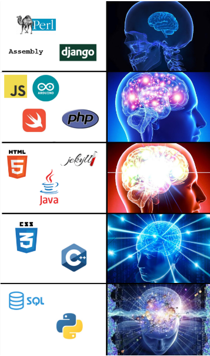

---

My name is Mairi but I also go by Mai/Mazza/Mars/that one with the [insert colour] hair. I am currently a third year Ethical Hacking student and the president-elect of the Feminist Society at Abertay University. I made this website so that I could make blogs and guides on various programming languages and projects that I do in my spare time. (Might also put my art on here at some point)

I've only been programming for ~seven years but in that time i've learnt a wide array of different languages and frameworks, both for education and as a hobby. I have decided the best way to explain my relationship to the languages and frameworks I know is through the medium of meme (memedium?):

  

  

